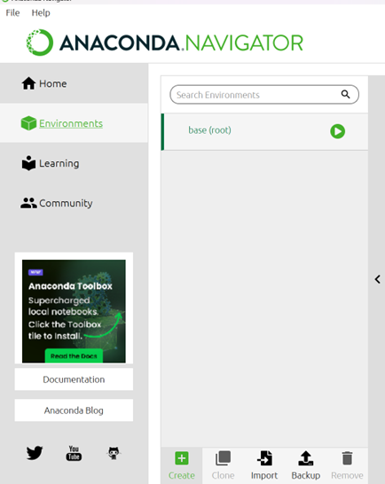

# Hoe gebruik je Jupyter Notebooks met Anaconda?

Hier wordt uitgelegt hoe je Jupyter Notebooks gebruikt in de IDE van Visual studio code en hoe je deze linkt aan een environment van Anaconda.

&nbsp;

## Inleiding 

### Wat kunnen deze programma's en waarom zou je ze gebruiken?

Met het programma Anaconda kun je omgevingen maken die je softwarepakketten kunnen beheren, zoals Python, Pip en Jupyter om er maar een paar te noemen.

Jupyter-notebooks zijn een vorm van universeel delen van data science-concepten, waarmee je live code kunt delen.

Visual studio code kan vele soorten coderingsbestanden beheren en kan worden gebruikt als gebruikersinterface, waardoor het praktischer in het gebruik is.

&nbsp;

## Inhoudsopgave

Hoofdstuk 1: De benodigde software downloaden 

Hoofdstuk 2: Een omgeving maken 

hoofdstuk 3: De benodigde plug-ins downloaden 

hoofdstuk 4: Een Jupyter-notebookbestand maken in Visual studio code 

hoofdstuk 5: Aansluiten en testen 

hoofdstuk 6: Bekende installatieproblemen en hoe te debuggen 

&nbsp; 

## Hoofdstuk 1: De benodigde software downloaden:
(Belangrijk!) Download eerst Anaconda en installeer de software vanuit het gedownloade .exe-bestand, voordat je verder gaat met Visual studio code.

&nbsp;

### Anaconda Download link: https://www.anaconda.com/download/

&nbsp;

Klik op de download van het besturingssysteem van je laptop, zoals Windows.

&nbsp;

Zoek de gedownloade set-up in kwestie die in jouw mapjes zit bij downloads en dubbelklik erop om de toepassing toe te voegen aan je computer.

&nbsp;

Volg de instructies die Anaconda geeft en verander de standaardaanbevelingen niet, de standaardinstellingen zijn voorlopig goed.

&nbsp;

### Visual studio code download: https://code.visualstudio.com/download

&nbsp;

Klik op de download van het besturingssysteem van je laptop, zoals Windows.

&nbsp;

Zoek de gedownloade set-up in kwestie die in jouw mapjes zit bij downloads en dubbelklik erop om de toepassing toe te voegen aan je computer.

&nbsp;

Volg de instructies die Visual studio code geeft en verander de standaardaanbevelingen niet, de standaardinstellingen zijn voorlopig goed.

&nbsp;

## Hoofdstuk 2: Een omgeving maken:

&nbsp;

Selecteer eerst het tabblad Omgeving en klik linksonder op Maak.

&nbsp;

Selecteer Python als dat nog niet het geval is en geef de omgeving een passende naam. Als je klaar bent, klik je rechtsonder op create.

&nbsp;

## Hoofdstuk 3: De vereiste plug-ins downloaden:

&nbsp;

Voor Visual Studio code installeer je de Python en jupyter plug-ins.

Je kunt ze vinden door op het pictogram van 4squares linksboven te klikken en de naam van de plug-in op te zoeken. Je hoeft alleen de hoofdplug-in te installeren, de rest wordt standaard geïnstalleerd.

&nbsp;

Op de startpagina van Anaconda's software applicatie download je de volgende plug-ins: Jupyter Notebook, Jupyter Lab en QT Console.

&nbsp;

## Hoofdstuk 4: Creating a Jupyter notebook file in Visual studio code: