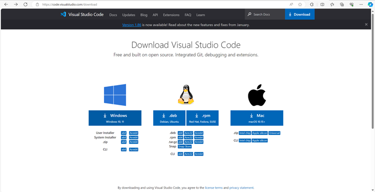

# Hoe gebruik je Jupyter Notebooks met Anaconda?

Hier wordt uitgelegt hoe je Jupyter Notebooks gebruikt in de IDE van Visual studio code en hoe je deze linkt aan een environment van Anaconda.

&nbsp;

## Inleiding 

### Wat kunnen deze programma's en waarom zou je ze gebruiken?

Met het programma Anaconda kun je omgevingen maken die je softwarepakketten kunnen beheren, zoals Python, Pip en Jupyter om er maar een paar te noemen.

Jupyter-notebooks zijn een vorm van universeel delen van data science-concepten, waarmee je live code kunt delen.

Visual studio code kan vele soorten coderingsbestanden beheren en kan worden gebruikt als gebruikersinterface, waardoor het praktischer in het gebruik is.

&nbsp;

## Inhoudsopgave

Hoofdstuk 1: De benodigde software downloaden (pagina 3-4)

Hoofdstuk 2: Een omgeving maken (pagina 5)

hoofdstuk 3: De benodigde plug-ins downloaden (pagina 6)

hoofdstuk 4: Een Jupyter-notebookbestand maken in Visual studio code (pagina 7)

hoofdstuk 5: Aansluiten en testen (pagina 8-9)

hoofdstuk 6: Bekende installatieproblemen en hoe te debuggen (pagina 10)

&nbsp; 

## De benodigde software downloaden:
(Belangrijk!) Download eerst Anaconda en installeer de software vanuit het gedownloade .exe-bestand, voordat je verder gaat met Visual studio code.

&nbsp;

### Anaconda Download link: https://www.anaconda.com/download/

&nbsp;

Klik op de download van het besturingssysteem van je laptop, zoals Windows.

&nbsp;

Zoek de gedownloade set-up in kwestie en dubbelklik erop om de toepassing toe te voegen aan je computer.

&nbsp;

Volg de instructies die Anaconda geeft en verander de standaardaanbevelingen niet, de standaardinstellingen zijn voorlopig goed.

&nbsp;

### Visual studio code download: Download Visual Studio Code - Mac, Linux, Windows

&nbsp;

Klik op de download van het besturingssysteem van je laptop, zoals Windows.

&nbsp;

Zoek de gedownloade set-up in kwestie en dubbelklik erop om de toepassing toe te voegen aan je computer.

&nbsp;

Volg de instructies die Visual studio code geeft en verander de standaardaanbevelingen niet, de standaardinstellingen zijn voorlopig goed.