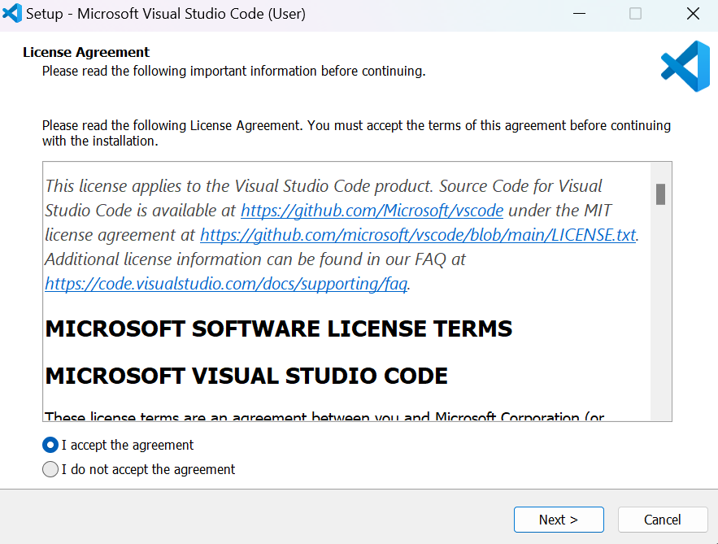
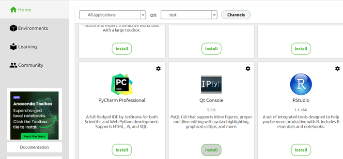
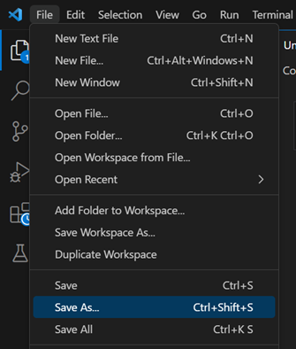
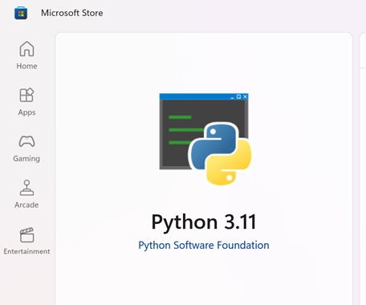

# Hoe gebruik je Jupyter Notebooks met Anaconda?

Hier wordt uitgelegt hoe je Jupyter Notebooks gebruikt in de IDE van Visual studio code en hoe je deze linkt aan een omgeving/environment van Anaconda.

  

## Inleiding 

### Wat kunnen deze programma's en waarom zou je ze gebruiken?

Met het programma Anaconda kun je omgevingen maken die je softwarepakketten kunnen beheren, zoals Python, Pip en Jupyter om er maar een paar te noemen. 

Jupyter-notebooks zijn een vorm van universeel delen van data science-concepten, waarmee je live code kunt delen.

Visual studio code kan vele soorten coderingsbestanden beheren en kan gebruikt worden als gebruikersinterface, waardoor het praktischer in het gebruik is.

           

## Inhoudsopgave

Hoofdstuk 1: Begrippenlijst:

Hoofdstuk 2: Download Anaconda

Hoofdstuk 3: Download Visual studio code

Hoofdstuk 4: Een omgeving maken 

hoofdstuk 5: De benodigde plug-ins downloaden 

hoofdstuk 6: Een Jupyter-notebookbestand maken in Visual studio code 

hoofdstuk 7: Aansluiten en testen 

hoofdstuk 8: Bekende installatieproblemen en hoe te debuggen 

          

## Hoofdstuk 1: Begrippenlijst:

  

### je kan hier op terug kijken als je worden niet begrijpt.

  

### (Anaconda) 

Een progamma waar je paketjes kan toevoegen aan folders die jij aan maakt, deze folders kan jij vervolgens aan IDE's verbinden zoals Visual Studio code het is dan ook mogelijk om via de command prompt in Visual studio code pakketjes te downloaden in jouw Anaconda omgeving/environment.

  

### (Een Anaconda omgeving/environment) 

Dit is een folder met een bepaalde naam die je maakt binenn de aplicatie Anaconda, Anaconda vult jouw folder met was basis paketjes van code zoals Python en Pip wanneer jouw jouw IDE de paketjes nodig heeft kan die ze lenen van Anaconda's folder.

  

### (Visual studio code / IDE)

Een IDE progamma of Integrated Development Environment/Geïntegreerde ontwikkelomgeving laat jouw verschillende soorten programmeer bestanden zoals HTML, CSS, Python, Jupyter notebook bewerken via de user interface van 

          

## Hoofdstuk 2: Download Anaconda:
(Belangrijk!) Download eerst Anaconda en installeer de software vanuit het gedownloade .exe-bestand, voordat je verder gaat met Visual studio code.

  

### Anaconda Download link: https://www.anaconda.com/download/

  

Klik op de download van het besturingssysteem van je laptop, zoals Windows.

    

Zoek de gedownloade set-up in kwestie die in jouw mapjes zit bij downloads en dubbelklik erop om de toepassing toe te voegen aan je computer.

    

Volg de instructies die Anaconda geeft en verander de standaardaanbevelingen niet, de standaardinstellingen zijn voorlopig goed.

          

## Hoofdstuk 3: Download Visual studio code:

### Visual studio code download: https://code.visualstudio.com/download

 

Klik op de download van het besturingssysteem van je laptop, zoals Windows.

    

Zoek de gedownloade set-up in kwestie die in jouw mapjes zit bij downloads en dubbelklik erop om de toepassing toe te voegen aan je computer.

    

Volg de instructies die Visual studio code geeft en verander de standaardaanbevelingen niet, de standaardinstellingen zijn voorlopig goed.

          

## Hoofdstuk 4: Een omgeving maken:

  

Selecteer eerst het tabblad Omgeving en klik linksonder op Maak.

    

Selecteer Python als dat nog niet het geval is en geef de omgeving een passende naam. Als je klaar bent, klik je rechtsonder op create.

          

## Hoofdstuk 5: De benodigde plug-ins downloaden:

  

Voor Visual Studio code installeer je de Python en jupyter plug-ins.

Je kunt ze vinden door op het pictogram van 4squares linksboven te klikken en de naam van de plug-in op te zoeken. Je hoeft alleen de hoofdplug-in te installeren, de rest wordt standaard geïnstalleerd.

    

Op de startpagina van Anaconda's software applicatie download je de volgende plug-ins: Jupyter Notebook, Jupyter Lab en QT Console.

          

## Hoofdstuk 6: Een Jupyter-notebookbestand maken in Visual studio code:

&nbsp;

Ga naar bestand/file en klik op nieuw bestand/new file.

    

Dit opent een prompt Selecteer "Jupyter Notebook".

    

Als je je bestand wilt opslaan, doe je het volgende: 

ga naar bestand > opslaan als > voer een naam en bestandslocatie naar keuze in.

Als je opslaat moet het bestandstype .ipynb zijn, de computer moet dit voor je doen.

          

## Hoofdstuk 7: Aansluiten en testen:

  

Schrijf deze code als een functionaliteitstest.

    

gebruik de opdracht: ctrl > shift > P in Visual studio code typ dan Python: Selecteer tolk/interperter:

    

Selecteer in de nieuwe prompt de omgeving die je eerder hebt gemaakt.

    

Je hebt een open terminal nodig om te testen of je omgeving verbonden is.

Als je geen terminal open hebt staan, kun je een terminal openen door linksboven op Terminal te gaan staan en op Nieuwe Terminal te klikken:

    

Nu kun je de juiste opdrachtprompt openen door naar de rechteronderkant te gaan, over het pijltje naast de + te gaan en op "Opdrachtprompt" te klikken.

    

Als je verbonden bent met je omgeving, zie je de naam links onderaan de opdrachtprompt, gevolgd door de pathing naar de bestanden.

          

## hoofdstuk 8: Bekende installatieproblemen en hoe te debuggen:

  

### Probleem 1: 

In sommige gevallen moet je Python installeren in de Microsoft store om een omgeving te kunnen selecteren in Visual studio code.

    

### Probleem 2:

Soms toont de terminal je omgeving niet op deze manier:

    

In dit geval moet de Kernel worden gewijzigd in de omgeving, om de terminal aan je omgeving te koppelen.

Ga met de muis over Kernel en klik op "Selecteer een andere kernel...".

    

Selecteer Python-omgevingen.

    

Selecteer nu je omgeving.

   